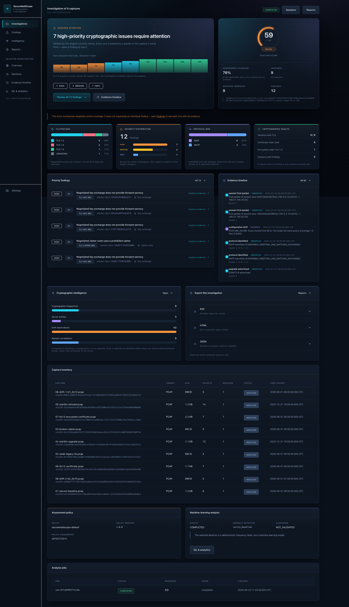
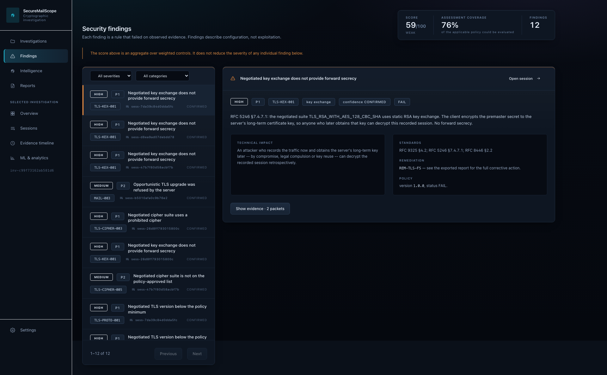
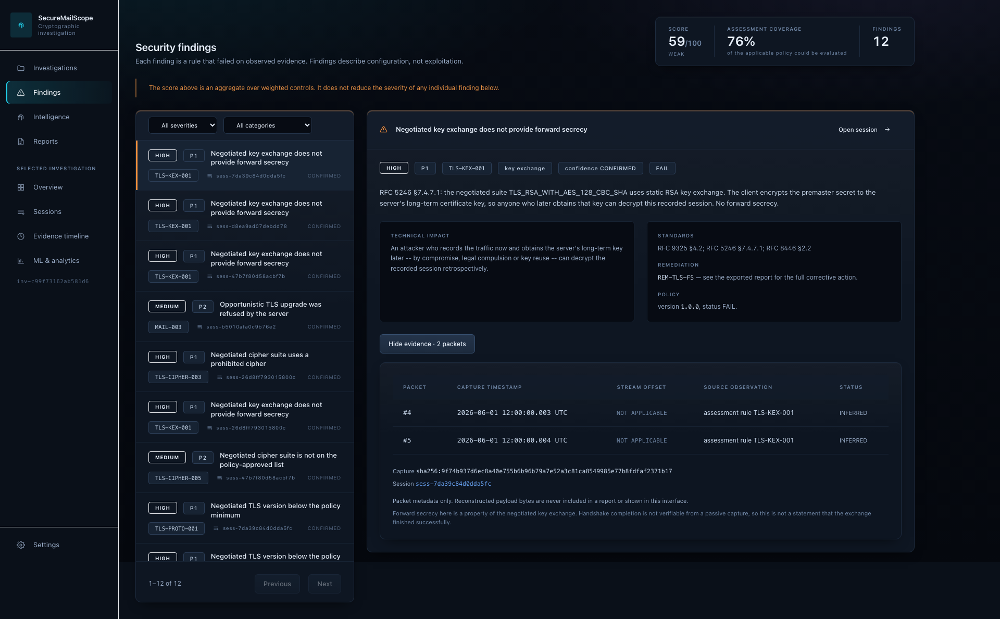
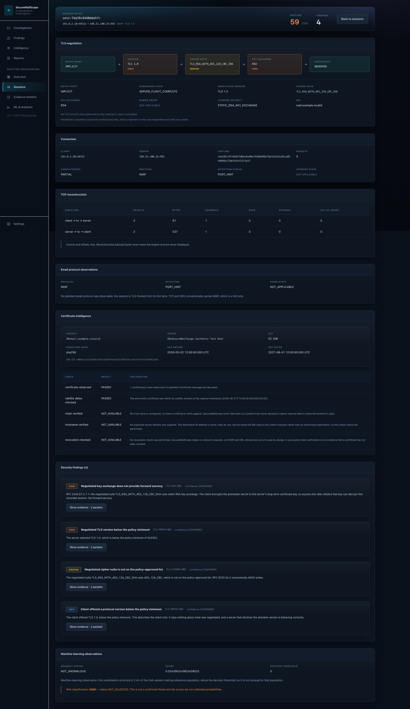
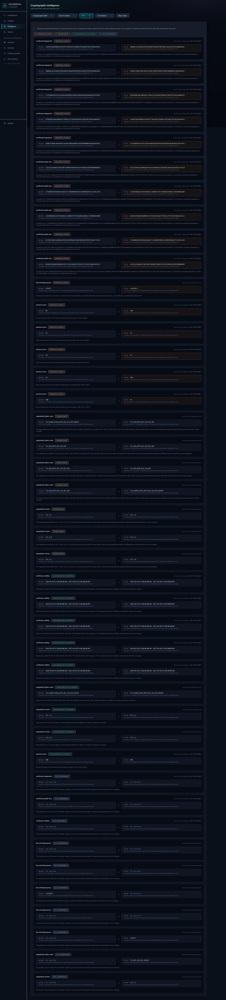
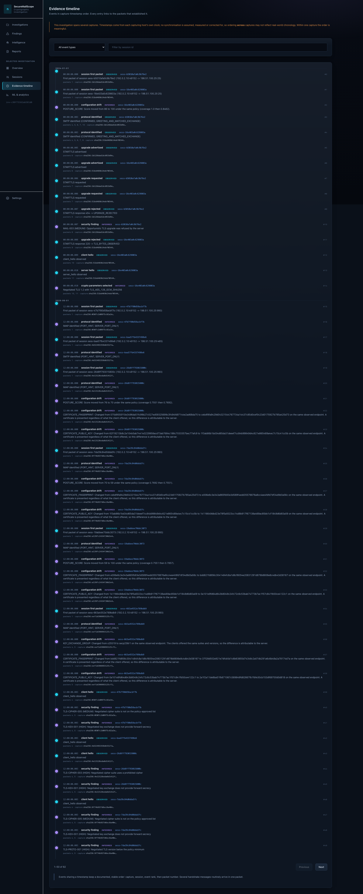

# SecureMailScope

**Passive cryptographic security posture assessment for captured email traffic.**

Smart India Hackathon 2026 · Problem Statement **SIH26159** · Category: Software
· Organisation: National Technical Research Organisation

---

## Problem statement

Email is still the backbone of official and enterprise communication, and it is
still carried over transports whose cryptographic quality nobody has actually
looked at. An organisation can tell you which mail servers it runs. It usually
cannot tell you which TLS versions those servers negotiated last Tuesday, which
cipher suites they accepted, which sessions had no forward secrecy, whether a
STARTTLS upgrade was offered and then refused, or whether a certificate that
verified in March still verifies now.

The information is already there, in the packet captures security teams
routinely collect. What is missing is a tool that reads them and answers the
question honestly — including saying "the capture does not show this" instead of
guessing.

Active scanners cannot answer it either. Connecting to a production mail server
to interrogate its TLS configuration tells you what it does *for a scanner
today*, not what it did for real clients during the period under
investigation — and in many environments an authorised investigator is not
permitted to touch the host at all.

## Overview

SecureMailScope reads a PCAP or PCAPNG file and reports what the bytes actually
show about how email was transported: which TCP sessions existed, how much of
each one the capture really contains, which mail protocol was spoken, whether
and where the session became encrypted, what was negotiated, what the
certificate said, which security rules failed, and what to do about it.

**Everything is local and passive.** The engine opens no socket. It never
contacts a host seen in a capture, never resolves a domain, never scans
anything, and never sends capture contents anywhere — including to a language
model. The only network traffic in the whole system is your browser talking to
`127.0.0.1`, which is the application's own interface.

Two design rules run through every layer:

**An observation is labelled with how it was obtained.** Every value carries one
of four statuses — `OBSERVED`, `INFERRED`, `UNKNOWN`, `NOT_AVAILABLE` — so a
port-based protocol guess can never be mistaken for a parsed dialogue, and an
encrypted TLS 1.3 certificate is reported as unavailable rather than left blank.

**A number that was not measured does not appear.** No score is invented, no
average is computed without a defined methodology, and a rule that could not be
evaluated is excluded from both sides of the scoring fraction rather than
counted as either a pass or a violation.

## Key capabilities

| Capability | What it actually does |
|---|---|
| **Capture ingestion** | PCAP and PCAPNG, format detected from content not extension, streamed under eight hard resource limits, every packet numbered and timestamped to nanoseconds |
| **TCP reconstruction** | Reordering, retransmission, gaps, overlapping-segment conflicts and tuple reuse. A byte that two segments disagree about is flagged ambiguous, not silently picked |
| **Email protocol analysis** | Real SMTP, IMAP and POP3 state machines. The protocol is identified from the dialogue; the port is only ever a hint, and is labelled as one |
| **STARTTLS reconstruction** | Advertisement, request, outcome, and the exact packet in each direction where plaintext stops. A refused upgrade is reported as refused, not as "no TLS offered" |
| **TLS analysis** | Record framing, handshake reassembly, negotiated version from `supported_versions` (never from `legacy_version`), cipher suite, key exchange from `key_share`, forward secrecy |
| **Certificate analysis** | X.509 parsing and RFC 5280 path verification: dates, chain, hostname, key size, signature algorithm — five independent checks with no defaults assumed |
| **Security assessment** | 25 rules under a versioned policy, an explainable score, a priority matrix, and 12 remediations with standards citations |
| **Cryptographic intelligence** | Fingerprints, server identity resolution, configuration drift between captures, cross-session correlation, an evidence timeline and blast-radius grouping |
| **Machine learning** | A deterministic rarity baseline in use; a trained Isolation Forest held back because it measured worse. Supervised classification is reported `NOT_VALIDATED` |
| **Reporting** | JSON, HTML and PDF from one canonical model, parity-tested, with no external resource fetched when a report is opened |
| **Local application** | FastAPI on loopback, SQLite persistence, and a nine-page React investigation dashboard |

Each capability's honest status — `IMPLEMENTED`, `PARTIAL`, `NOT_IMPLEMENTED`
or `NOT_VERIFIED` — is in
[docs/requirements-matrix.md](docs/requirements-matrix.md), and the same table is
emitted into every report so a reader never has to guess whether a missing
section means "nothing in the capture" or "not built".

## Architecture

```
  PCAP/PCAPNG ──▶ ingestion ──▶ TCP reconstruction ──┬──▶ email protocols ──┐
   (untrusted)     1,166 loc        ~900 loc         │       3,406 loc      │
                                                     └──▶ TLS ──▶ X.509 ────┤
                                                        3,042     861 loc   │
                                                                            ▼
                                                            security assessment
                                                                 3,416 loc
                                                                     │
                                          ┌──────────────────────────┴───┐
                                          ▼                              ▼
                                 intelligence 2,275 loc          ML 3,196 loc
                                          └──────────────┬───────────────┘
                                                         ▼
                                            ONE canonical report model
                                                   1,582 loc
                                            JSON  ·  HTML  ·  PDF
```

The full diagram, including the local application and the passive boundary, is
in [docs/diagrams/architecture.md](docs/diagrams/architecture.md).

**The engine depends on three packages** — `scapy`, `pydantic`, `cryptography` —
and nothing else. FastAPI, SQLAlchemy, scikit-learn, ReportLab and Jinja2 are
optional extras, and a test walks the AST of every engine module to prove the
web and ML stacks cannot reach the analysis path.

## Technology stack

| Layer | Choice | Why |
|---|---|---|
| Engine | Python 3.12, Scapy 2.7.0 (dissection only), Pydantic 2.9.2 | Scapy for a mature dissector; Pydantic because every output is a validated, versioned schema |
| Certificates | cryptography 50.0.1 | The RFC 5280 verification API, rather than hand-rolled chain logic |
| Assessment | Pure Python, no framework | Rules are data under a versioned policy; a finding id changes when the policy changes |
| ML | scikit-learn 1.5.2, NumPy 2.1.3 | A rarity baseline was selected over Isolation Forest *by measurement*, and the model that lost is still shipped and labelled |
| API | FastAPI 0.141.1, Uvicorn, SQLAlchemy 2.0.36, SQLite | One process, one file, no services to run. FastAPI is an adapter over the unchanged engine |
| Reports | Jinja2 3.1.6 (HTML), ReportLab 4.2.5 (PDF) | ReportLab has no URL resolver, so "fetches nothing" is structural, not a promise |
| Frontend | React 18, TypeScript strict, Vite 8, Tailwind, Recharts | Strict TypeScript because a dashboard that renders `undefined` as `0` would be lying |
| Testing | pytest 9.1.1, hypothesis, Playwright, Vitest, TShark | TShark as an *independent* dissector to cross-check our own parse |

## Installation

Requires Python 3.12 (the project pins `>=3.12,<3.13`) and Node 22+ for the
dashboard.

```bash
git clone https://github.com/sgtsujith141-wq/securemailscope.git
cd securemailscope

python3.12 -m venv .venv
.venv/bin/pip install -e '.[dev,backend,ml,reporting-tests]'

# Generate the synthetic test fixtures (none are committed).
.venv/bin/python scripts/generate_fixtures.py
```

For a byte-reproducible install, use the hash-pinned lock instead:

```bash
.venv/bin/pip install --require-hashes -r requirements-lock-hashes.txt
```

The engine alone, with no web, ML or reporting stack:

```bash
.venv/bin/pip install .     # 3 declared dependencies
```

## Running the application

**Command line only:**

```bash
.venv/bin/python -m securemailscope analyze capture.pcap -o report.json
.venv/bin/python -m securemailscope analyze-batch a.pcap b.pcap -o investigation.json
.venv/bin/python -m securemailscope status        # honest per-stage status
```

**The local application:**

```bash
# Terminal 1 -- the API. Binds 127.0.0.1 and prints its token on first start.
.venv/bin/python -m securemailscope.backend.server

# Terminal 2 -- the dashboard.
cd frontend && npm install && npm run dev
```

Then open `http://127.0.0.1:5173`. The API binds loopback only, answers only to
localhost hostnames, and requires a per-installation token stored outside the
repository with mode 0600.

## Analysing a capture

A reproducible demonstration dataset is built from the project's own fixture
generators — nine synthetic captures covering a sound configuration, weak ones, a
STARTTLS upgrade and a refusal, a readable TLS 1.2 certificate, the TLS 1.3
encrypted-certificate limitation, and a two-capture drift pair:

```bash
.venv/bin/python scripts/build_demo_dataset.py
```

What the engine reports for that set — measured, not illustrative:

| capture | sessions | findings | score | negotiated |
|---|---:|---:|---:|---|
| `01-secure-baseline.pcap` | 1 | 0 | 100 | TLS 1.2 |
| `02-weak-legacy-tls.pcap` | 1 | 4 | 59 | TLS 1.0 |
| `03-broken-cipher.pcap` | 1 | 2 | 70 | TLS 1.2 |
| `04-starttls-upgrade.pcap` | 1 | 0 | 100 | TLS 1.2 |
| `05-starttls-refused.pcap` | 1 | 1 | 86 | — (stayed plaintext) |
| `06-tls12-certificate.pcap` | 1 | 0 | 100 | TLS 1.2 |
| `07-tls13-encrypted-certificate.pcap` | 1 | 0 | 100 | TLS 1.3 |

The clean control matters as much as the weak cases: a tool that only ever
reports problems is not measuring anything.

## Understanding the findings

A finding is not an alert. It is a statement about an observed configuration,
with the packets it was read from. Here is a real one, verbatim from
`02-weak-legacy-tls.pcap`:

```
TLS-KEX-001   HIGH   CONFIRMED   FAIL   priority P1

  Negotiated key exchange does not provide forward secrecy

  RFC 5246 §7.4.7.1: the negotiated suite TLS_RSA_WITH_AES_128_CBC_SHA uses
  static RSA key exchange. The client encrypts the premaster secret to the
  server's long-term certificate key, so anyone who later obtains that key
  can decrypt this recorded session. No forward secrecy.

  Impact       An attacker who records the traffic now and obtains the
               server's long-term key later -- by compromise, legal
               compulsion or key reuse -- can decrypt the recorded session
               retrospectively.

  Evidence     packets 4 and 5
  Standards    RFC 9325 §4.2 · RFC 5246 §7.4.7.1 · RFC 8446 §2.2
  Remediation  REM-TLS-FS -- use an ephemeral key exchange so recorded
               traffic stays unreadable if the key is later exposed

  Limitation   Forward secrecy here is a property of the negotiated key
               exchange. Handshake completion is not verifiable from a
               passive capture, so this is not a statement that the
               exchange finished successfully.
```

Four things to notice. The rule cites the RFC it applies. The evidence is a
packet number you can open in Wireshark. The remediation is specific. And the
limitation is printed *with the finding*, not buried in an appendix.

That capture produces four findings, prioritised `P1, P1, P2, P4`, and scores
**59/100 (WEAK)** — with the arithmetic shown:

```
score = 100 × (W(evaluated) − W(failed)) / W(evaluated)
8 of 10 applicable units were evaluable, carrying 37 weight.
3 failed, deducting 15. 100 × (37 − 15) / 37 = 59.5, rounded to 59.
2 units could not be evaluated and are excluded from both sides.
```

**A score describes one capture.** For an investigation of several, the headline
is the *weakest* scored capture, with the range alongside it — never an average,
because no methodology for weighting captures against each other has been
validated, and never the first capture, because a clean one sorting first would
hide a weak one behind it.

## Screenshots

Genuine captures of the running application on the synthetic demo dataset,
regenerated by `SMS_SCREENSHOTS=1 npx playwright test submission-shots`:

| | |
|---|---|
|  |  |
| **Investigation dashboard.** Nine captures. The conclusion first, the weakest capture's score beside it with its scope stated, then the cryptographic modules. | **Findings workspace.** The list stays visible while the detail carries the description, the impact, the standards it cites and the packets behind it. |
|  |  |
| **A finding and its packets.** Every finding links to the packet numbers it was read from. Payload bytes are never included. | **The handshake as a chain.** Entry point, version, cipher suite, key exchange, certificate — each tinted by the findings raised against it. |
|  |  |
| **Configuration drift.** One endpoint across captures, before and after, with what the comparison cannot establish stated on each pair. | **Evidence timeline.** Every event ordered, each dot carrying its evidence status: observed in a packet, or inferred. |

All screenshots use synthetic data with `.invalid` hostnames. No real
investigation, capture or personal data appears in any of them.

## Testing and validation

Fresh results against the release commit, not carried over from an earlier
milestone:

| Gate | Result |
|---|---|
| Python test suite | **1,357 passed**, 25 skipped |
| With TShark cross-checks enabled | **1,367 passed**, 15 skipped |
| Lint (`ruff`) | clean |
| Type check (`mypy`) | clean over **156 files** — `src/`, `tests/` and `scripts/` |
| Frontend unit tests | **89 passed** |
| Frontend type check, lint and production build | clean |
| Browser end-to-end | **5 specs**, real backend, real engine, nothing mocked |
| Visual QA sweep | **40 page loads** across four viewports: no overflow, no failed request, no console error |
| Demonstration rehearsal | **14 steps, 0 failures** |
| Python dependency audit (`pip-audit`) | **0 known vulnerabilities** |
| Frontend audit (`npm audit`) | **0 vulnerabilities**, production and development |
| Clean install from a bare checkout | verified, engine-only and full |
| Git history privacy audit | 796 blobs across every ref: nothing sensitive |

```bash
make check                                   # lint, type-check, test
SECUREMAILSCOPE_TSHARK=1 .venv/bin/pytest -q # with the independent cross-check
make audit && make sbom                      # vulnerabilities and bill of materials
cd frontend && npm run test && npm run e2e   # frontend and browser
cd frontend && SMS_SCREENSHOTS=1 npx playwright test visual-qa   # every page, every size
```

**Fixtures are not tautological.** Expectations are hand-derived and committed
as manifests; the captures themselves are generated and gitignored. The
independent check is TShark: ten cross-checks compare our dissection against a
different implementation's, so a shared bug in our own parser cannot validate
itself.

## Performance limitations

Measured on synthetic captures, on one machine. Acceptance thresholds were
written down and committed **before** the results they judge — the order is
visible in the repository history.

| profile | packets | median | packets/s | peak RSS |
|---|---:|---:|---:|---:|
| small | 150 | 0.089 s | 1,686 | 190 MB |
| medium | 1,200 | 0.859 s | 1,398 | 270 MB |
| large | 6,000 | 4.730 s | 1,268 | 625 MB |
| stress | 24,000 | 21.426 s | 1,120 | 1,800 MB |

Ground truth matched exactly at every size, including stress.

**What these numbers do not establish.** They were taken on an idle machine with
16 logical CPUs. A repeat run while unrelated work held the load average between
14 and 20 measured **257 packets/second** — a fifth of the figure above, and a
clear failure against the 500 packets/second threshold. That result is kept in
[docs/performance-benchmarks.md](docs/performance-benchmarks.md) rather than
discarded, and neither the threshold nor the published figures were adjusted.

**Memory is the binding constraint,** not speed: about 76 KB of peak resident
memory per packet. Two analyses share one process, so the application is not
claimed to handle 24,000-packet captures on the 8 GB machine the thresholds
assume. No run on that hardware has been taken; that requirement is recorded
`NOT_VERIFIED`.

## Privacy and security

Packet captures of email traffic contain credentials, message bodies and
personal data. Read [SECURITY.md](SECURITY.md) before a real capture goes
anywhere near this repository.

**What the tool does not do.** It never opens a socket, contacts a captured
host, resolves a domain, or transmits capture contents anywhere. Reports contain
packet numbers, timestamps and offsets — never payload bytes, credentials or
message content. Authentication is recorded as *presence and mechanism only*.

**What the application does about a local attacker.** Binding to loopback stops
nothing on its own: a web page you visit can send requests to `127.0.0.1`, and
DNS rebinding turns an attacker's hostname into a local address. So there is a
host allowlist, an explicit CORS origin list with credentials off, a
per-installation token outside the repository, bounded collection responses,
magic-byte upload validation while streaming, and error bodies that carry no
path or stack trace. Each control has a test that fails if it is removed.

**This is not a penetration test and not a security certification.** No external
assessor was involved. The application is not safe to expose to a network, and
that is not claimed. See [docs/security-audit.md](docs/security-audit.md) for
what the audit covered and what it did not.

**Nothing sensitive is committed.** Captures, keys, tokens, databases and
environment files are gitignored; `make secrets-check` inspects the staging area
before every commit; and `scripts/audit_history.py` walks every blob in the
history, because a clean working tree proves nothing about earlier commits.

## Known limitations

Read this section before trusting a result.

**Permanent, by physics or by design:**

- **TLS 1.3 certificates cannot be read.** TLS 1.3 encrypts the Certificate
  message. No passive tool can see it. Reported `NOT_AVAILABLE` with the reason.
- **Revocation is never checked.** That needs an OCSP or CRL request, which the
  passive-only rule forbids. `revocation_checks_performed` is `0` in every
  report.
- **Handshake completion is not verifiable.** A capture does not contain the
  traffic keys. `handshake_analyzed` is `false` and
  `handshakes_cryptographically_verified` is `0` in every report, asserted by
  the test suite rather than left to trust.
- **Encrypted payloads stay encrypted.** The tool assesses how transport was
  protected, not what was sent.

**Current, and honestly open:**

- **Supervised risk classification is `NOT_VALIDATED`.** It is implemented and
  measured on synthetic data (macro-F1 0.5624) and is *not* fit for real-world
  use. Synthetic evaluation does not establish real-world accuracy, and no
  independent representative validation has been obtained.
- **All ML evaluation is synthetic**, by design: the project does not ingest
  private email traffic.
- **Analysis cannot be cancelled.** A running analysis finishes or fails. There
  is no endpoint, no `CANCELLED` status and no button — and a test asserts their
  absence, so the gap cannot be mistaken for a broken control.
- **Benchmarks have not been run on the assumed minimum hardware.**
- **Colour contrast is checked at the design-token level**, not sampled from
  rendered pixels.
- **The requirements matrix is derived** from the product definition and the
  implementation directives, not from the canonical SIH26159 problem statement
  text, which is not reproduced here. When that text is attached it must be
  reconciled line by line.

## Team and acknowledgments

Team **Zero-Day** — Smart India Hackathon 2026, problem statement SIH26159,
theme *Blockchain & Cybersecurity*, category *Software*, team ID 146876.

Problem statement provided by the **National Technical Research Organisation**.

Built on Scapy, Pydantic, python-cryptography, FastAPI, SQLAlchemy,
scikit-learn, ReportLab, React and Vite — and cross-checked against **TShark**
(Wireshark), whose independent dissection is what makes our own parse
trustworthy rather than self-confirming.

## References

Standards the rules cite, and the specifications the parsers implement:

- RFC 9325 — Recommendations for Secure Use of TLS and DTLS (2022)
- RFC 8446 — The Transport Layer Security (TLS) Protocol Version 1.3
- RFC 5246 — The Transport Layer Security (TLS) Protocol Version 1.2
- RFC 5280 — Internet X.509 Public Key Infrastructure Certificate and CRL Profile
- RFC 6125 — Representation and Verification of Application Service Identity
- RFC 3207 — SMTP Service Extension for Secure SMTP over TLS
- RFC 2595 — Using TLS with IMAP, POP3 and ACAP
- RFC 5321 — Simple Mail Transfer Protocol
- RFC 9051 — Internet Message Access Protocol Version 4rev2
- RFC 1939 — Post Office Protocol Version 3
- RFC 8996 — Deprecating TLS 1.0 and TLS 1.1
- RFC 7457 — Known Attacks on TLS and DTLS
- RFC 4492 — ECC Cipher Suites for TLS
- NIST SP 800-52 Rev. 2 — Guidelines for TLS Implementations
- IANA TLS Parameters registry — cipher suites, groups, signature schemes

Project documentation:

| Document | What it covers |
|---|---|
| [docs/requirements-matrix.md](docs/requirements-matrix.md) | Every requirement → module → test → honest status |
| [docs/limitations.md](docs/limitations.md) | What passive analysis cannot do |
| [docs/evidence-model.md](docs/evidence-model.md) | The four evidence statuses and provenance |
| [docs/scoring-methodology.md](docs/scoring-methodology.md) | The formula, the bands, and multi-capture aggregation |
| [docs/security-audit.md](docs/security-audit.md) | Threat model, controls, and what the audit missed |
| [docs/performance-benchmarks.md](docs/performance-benchmarks.md) | Measured performance and its limits |
| [docs/ml-model-card.md](docs/ml-model-card.md) | What the models are, and are not, fit for |
| [docs/reliability-testing.md](docs/reliability-testing.md) | Malformed input, restart, concurrency |
| [docs/dependency-audit.md](docs/dependency-audit.md) | Every dependency and its advisories |
| [docs/release-readiness.md](docs/release-readiness.md) | What is verified and what is not |
| [docs/milestones/](docs/milestones/) | Milestone reports M0 through M9 |

## Licence

**No licence has been granted.** All rights reserved by the authors pending an
explicit licensing decision. The repository is public so that judges and
reviewers can read the source and reproduce the results; publication is not a
grant of any rights over it.
